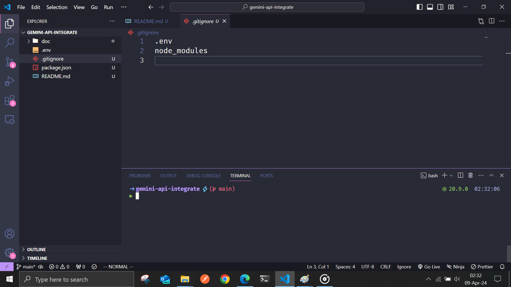

# FrontEnd

- Github Repo : [Link](https://github.com/foy4748/-gemini-api-integrate-frontend)

# Instructions

- First go to [Google AI Studio](https://aistudio.google.com/)
- Accept Terms \& Conditions. (For first time only)
  
- Then Click [Get API Key] button at the left-upper corner. Then click [Create API Key] button. Accept any terms they want you to accept.
  

- Click [Create API key in new project]. Then after generating the key, copy the key in the .env file in your project. Store it in a convenient environment variable.

- Initiate a node application by running `npm init` in a folder. As you've guessed it, the .env file must be in that folder.

- **Important** ! Add a .gitignore file mentioning `.env` and `node_modules` since, these shouldn't be pushed to github, because,

  - `.env` file contains secret API key which shouldn't go to github.
  - `node_modules` can be regenerated by running `npm install` command, so no need to populate github repo unnecessarily.

  

- Then go to the [Docs Page](https://ai.google.dev/docs). And go to [Get Started with Node](https://ai.google.dev/tutorials/get_started_node#add-sdk) and follow instructions. First you can simply install the npm package that they are providing.

```console
npm install @google/generative-ai
```

- Also you would need other packages

```console
npm install express dotenv cors
npm install --save-dev nodemon
```

- Now create a typical express app, which contains atleast one `POST` API endpoint. The endpoint will recieve text instructions in the `POST` body, and generate answer with the help of Gemini.
